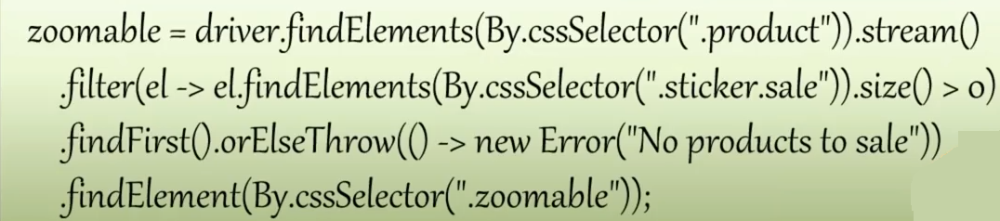
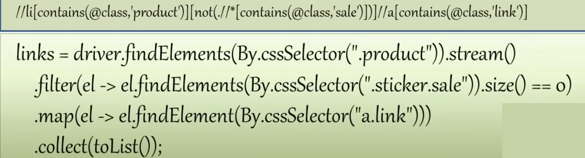

## Лекция от Алексея Баранцева
___
### Что такое локаторы?

**Локатор** - критерий отбора, по которому мы находим на странице web приложения какие-то элементы. 

Для того чтобы кликнуть на какую-то кнопку, ее необходимо сначала найти. И вот критерий, по которому находится 
данная кнопка, и есть локатор.

**DOM** (Document Object Model)

**Свойства хорошего локатора**:
- точность (находит то, что нужно)
- уникальность (не находит то, что не нужно)
- простота, понятность
- устойчивость к изменениям (тут зависит от приложения, если чаще всего меняется верстка, то устойчивым к изменению 
верстки; если приложение часто меняет сервер, то не нужно нигде в локаторах использовать адрес сервера; если часто 
переписываются тексты, тогда должна учитываться устойчивость к изменению текстов)
___
### Предпочитайте CSS

Если нет никаких требований по использованию каки-то конкретных типов локаторов, то лучше всего использовать CSS.
**CSS** - язык запросов, который был разработан для дизайнеров. Его используют не только дизайнеры, но и разработчики 
фронтенда, верстальщики и тестировщики автоматизаторы.

Другие пути поиска:
- по идентификатору
- по имени класса
- по имени
- XPath

Почему стоит использовать CSS всегда - для единообразия. Не стоит прыгать от одного метода к другому и наоборот.
___
### DevTools 

F12 - открыть DevTools

В консоли DevTools запросы в виде функций `$("css_selector")` позволяют искать что-либо с помощью CSS, а 
`$x("xpath_selector")` - с помощью XPath:
- $(".product")
- $("//a") - находит все ссылки, которые есть на странице
___

#### 1. Используйте то, что не подвержено изменениям
(или наоборот, не используйте то, что подвержено изменениям)

#### 2. Используйте семантические признаки, а не синтаксические

Семантика - смысл, синтаксис - как правильно записывается.

Примеры хороших локаторов:
- `li.product` - product это семантический признак, так как указывает на то, что данный объект описывает
какой-то продукт
- `#navigation` - элемент "навигационное меню"


Примеры плохих локаторов:
- `li.hover-light` - не семантический признак, показывает, что при наведении на данный объект что-то будет 
подсвечиваться, но не ясно что. Не можем по этому признаку понять, что это за элемент и какой у него смысл.
- `.column-left.box`

В случае поля ввода может быть несколько локаторов, которые подходят. И в зависимости от логики задачи, следует выбрать 
либо первый, либо второй: `input[type="serch"]`, `input[name="query"]`

#### 4. Проверяйте уникальность

Особенно, если ищите несколько элементов, важно проверить, что не нашлось чего-то лишнего. И если есть, то значит, 
что тех признаков, которые уже выявили, не достаточно, чтобы отсеять все ненужные элементы.

#### 4.1 Зацепки / Якоря
Они крепятся к чему-то более прочному, уникальному, стабильному. И дальше относительно этого уникального и стабильного
элемента можно производить поиск нужных элементов с большей свободой.

Допустим нужно найти ссылки на все продукты. Если искать просто по локатору `а`, то результатов юудет больше, чем нужно.
Но если задать `.product a`, то `.product` как раз выступит тем самым якорем, который позволит отфильтровать только 
товары, а полный запрос как раз выдаст ссылки, находящиеся в блоках товаров (т.е. как рах ссылки на товары).

Если нужно найти ссылку на продукт, который находится внутри какого-то конкретного блока, например, наиболее 
популярные товары, тогда:
`#box-most-popular .product a`

2-3 зацепки/якоря - обычно предел. Более сложные локаторы обычно редко встречаются.

Какие-то элементы list-item, которые не имеют каких-то собственных признаков, но знаем, что находятся в меню, поэтому
привязываем их к элементу, имеющему уникальный идентификатор `#site-menu`:
`#site-menu li`

Ищем ссылку внутри подвальной части страницы, которая как раз и является привязкой:
`#footer a[href*=privacy-policy]`

#### 5. Используйте комбинации

Примеры:
- `#box-most-popular .product a`
- `#footer a[href*=privacy-policy]`
- `select[name=zone_code]` (есть несколько элементов с именем `zone_code`, то только один, нужный нам, имеет тег 
выпадающего списка `select`)
- `li[id^=select2-country_code][id$=US]` Идентификатор элемента какой-то сложный и мы задаем несколько фрагментов
условий для него, наиболее понятных, точно не изменяющихся, но определяющих его однозначно
- `a[href*=user_edit]:not([href$='user_id=1])` - Найти ссылку на редактирование пользователя, у 
которого идентификатор не равен 1.

#### 6. Избегайте избыточности

Иногда в погоне за уникальность можно перестараться и наложить слишком много условий. Конечно, в данном случае локатор 
будет очень точным и не будет находить ничего лишнего, но он становится слишком сложным. А всю лишнюю сложность 
стоит убирать. Важно выбрать ровно столько признаков, сколько нужно по минимуму и не более того.

#### 7. "Где-то в" или "прямо в"

Чаще всего используется все же правило "где-то внутри" блока.

Но иногда требуется найти именно "прямо внутри" блока.
Например, нас интересуют ссылки, находящиеся где в меню, тогда будет так: `#site-menu li`. Сюда попадут как ссылки 
верхнего меню, так и всех вложенных.  
Но если требуется найти ссылки только верхнего меню, то нужно уточнить место нахождения локатора:
`#site-menu > ul > li`

#### 8. Не ищите по тексту

Лучше оставлять это на самый крайний случай. Современные приложения часто бывают интернациональными, то поиск по тексту
при изменений базовых настроек языка перестанет работать.

#### 9. Не используйте номера

Порядок элементов может измениться.

#### 10. Общайтесь с разработчиками

Если все, что есть не работает, то имеет смысл обратиться к разработчикам. Иначе приложение останется не тестопригодным.
___

**Для задания 8** через XPath

```python
from selene import browser

def test_8(self):
    # 8.Подберите локатор для поиска на странице http://litecart.stqa.ru/index.php/en/acme-corp-m-1/ иконки-лупы
    # для увеличения картинки товара, имеющего стикер Sale
    browser.open('/acme-corp-m-1/')
    
    browser.element('//*[contains(@class, "sticker") and contains(@class, "sale")]/../../../*[contains(@class, "zoomable")]').click()
    # или (вариант с подзапросом) (ищем элемент класса product,  котором есть элемент класса 'sale'. И потом уже ...
    # browser.element('//li[contains(@class, "product")][.//*[contains(@class, "sale")]]//*[contains(@class, "zoomable")]').click()
```

Либо написать на языке программирования запрос:

<p align="center">

</p>

___
**Для задания 9** через XPath или через запрос на языке программирования:

<p align="center">

</p>

___
**Для задания 10** нет вообще хорошего решения. Так как какой бы локатор мы не выбрали, он скорее всего со временем 
изменится. В данном случае лучше всего обратиться к разработчикам.